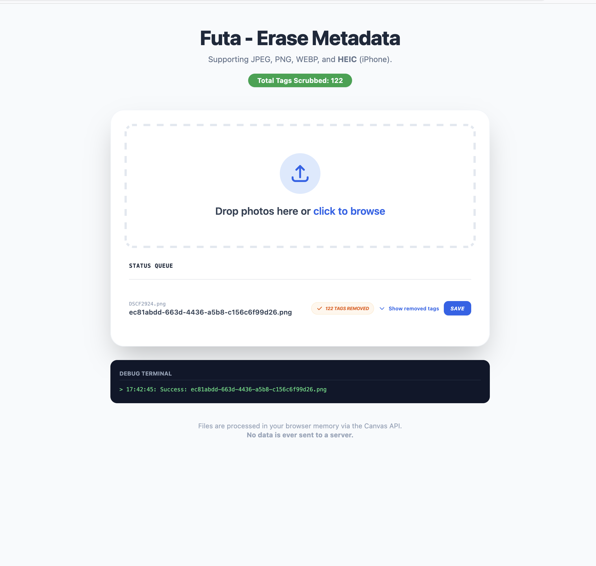
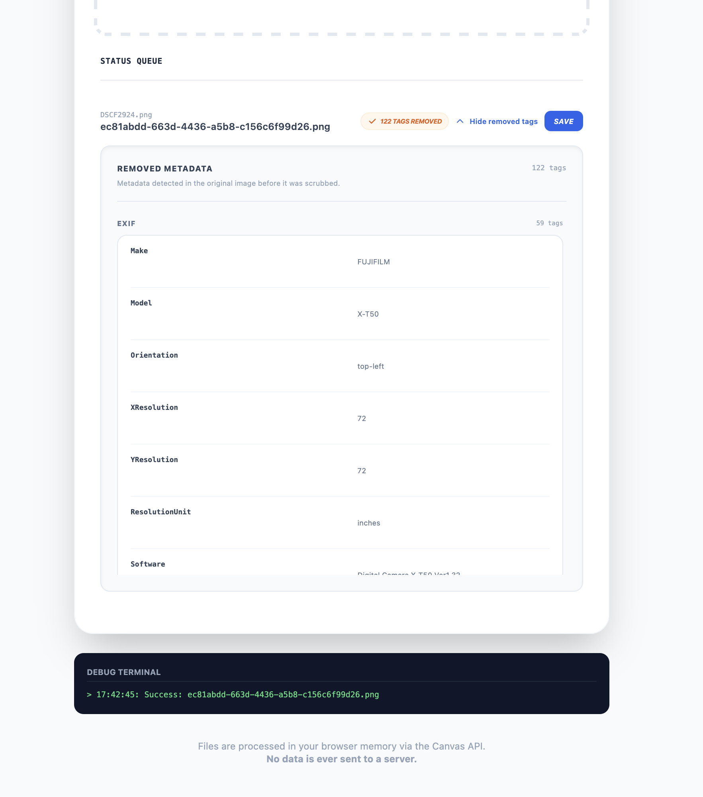

### Scrub Metadata

Clean your images locally using your local browser, no data sent to a server. This is a progressive web app so you can add to your local machine so that it behaves like a standalone app.

### Notes
- Files are processed in your browser memory via the Canvas API.
- Canvas decodes the image and writes fresh pixel data into a newly encoded image, leaving the original metadata behind.
- No data is ever sent to a server.

#### Screenshot

Here is a screenshot of the web app

    

This is how the metadata details section looks like

    

